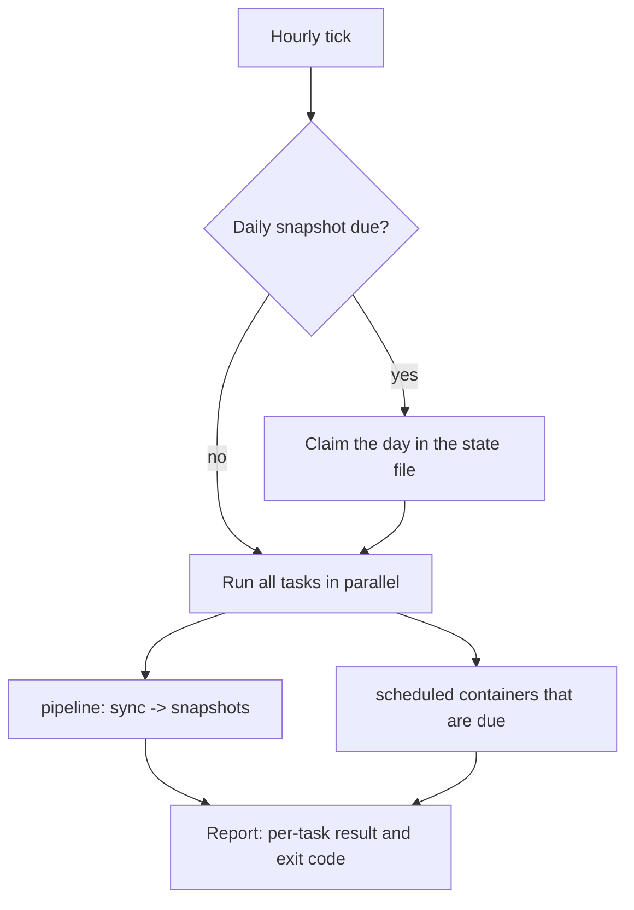

# Docker Orchestrator

A small, dependency-free Python service that starts Docker containers in a
configured order on an hourly and daily schedule — sync first, snapshots
afterwards, plus any number of standalone scheduled containers.

- [Quick start](#quick-start)
- [How a cycle works](#how-a-cycle-works)
- [Project structure](#project-structure)
- [Command line reference](#command-line-reference)
- [Configuration reference](#configuration-reference)
- [Scheduling rules](#scheduling-rules)
- [Failure handling](#failure-handling)
- [Status reporter (serverStatusPage)](#status-reporter-serverstatuspage)
- [Running as a service](#running-as-a-service)
- [Development](#development)
- [Notes and limitations](#notes-and-limitations)

---

## Quick start

```powershell
# 1. Requirements: Python 3.10+ and a working Docker CLI
pip install -r requirements.txt        # only needed on Windows (tzdata)

# 2. Create your config
copy docker_schedule_config.example.json docker_schedule_config.json

# 3. Check it before trusting it
python docker_orchestrator.py --validate-config
python docker_orchestrator.py --dry-run

# 4. Run one cycle now, or run as a daemon
python docker_orchestrator.py --once --ignore-hourly-tick
python docker_orchestrator.py
```

`python -m orchestrator` is equivalent to `python docker_orchestrator.py`.

### Requirements

| Requirement | Notes |
| --- | --- |
| Python 3.10+ | Standard library only; no runtime dependencies |
| Docker CLI + daemon | The CLI must be on the `PATH` of the user running the service |
| `tzdata` (Windows only) | Windows ships no IANA timezone database, so `"Europe/Prague"` cannot be resolved without it. Either `pip install tzdata` or set `schedule.timezone` to `"UTC"` |

---

## How a cycle works

On every hourly tick:



Within one pipeline the order is strict:

1. Run the **sync** container and wait for it.
2. Then run the **hourly snapshot** — and, when the daily snapshot is due, run
   the hourly and daily snapshots **in parallel**.

Pipelines run concurrently with each other and with scheduled containers.
A container that is already running is never started a second time; the
orchestrator attaches to the running job and waits for it.

---

## Project structure

Each class lives in its own module. The dependency direction is one-way:
`runtime` → `config`/`docker_cli`/`state`/`scheduling`, and `config` →
`scheduling`, never back.

```
docker_orchestrator.py            # CLI entry point (thin shim)
requirements.txt
docker_schedule_config.example.json
orchestrator/
├── cli.py                        # Cli — argument parsing and wiring
├── logging_setup.py              # LoggingSetup — console + rotating file logs
├── errors.py                     # exception hierarchy (OrchestratorError, ...)
├── config/
│   ├── field_reader.py           # FieldReader — typed reads with full key paths
│   ├── schedule_config.py        # ScheduleConfig — when to act
│   ├── runtime_config.py         # RuntimeConfig — timeouts, retries, parallelism
│   ├── pipeline_config.py        # PipelineConfig — one sync -> snapshot chain
│   ├── scheduled_container_config.py  # ScheduledContainerConfig
│   ├── app_config.py             # AppConfig — the whole file, validated
│   └── config_loader.py          # ConfigLoader — read from disk, detect edits
├── docker_cli/
│   ├── container_name.py         # ContainerName — name validation
│   ├── command_result.py         # CommandResult — one finished CLI call
│   ├── docker_command.py         # DockerCommand — subprocess, timeouts, retries
│   ├── container_runner.py       # ContainerRunner — the abstract contract
│   └── docker_runner.py          # DockerRunner — start / wait / diagnose
├── scheduling/
│   ├── clock.py                  # Clock — timezone-aware "now"
│   ├── periods.py                # Period — hourly / daily / every_N_hours
│   ├── schedule_evaluator.py     # ScheduleEvaluator — tick arithmetic
│   └── scheduled_container_selector.py  # ScheduledContainerSelector
├── state/
│   ├── run_state_store.py        # RunStateStore — atomic JSON key/value file
│   └── daily_run_state.py        # DailyRunState — which day already ran
├── status/                       # optional reporting to the serverStatusPage dashboard
│   ├── status_config.py          # StatusReporterConfig — the status_reporter section
│   ├── request_signer.py         # RequestSigner — HMAC-SHA256, shared with the API
│   ├── status_api_client.py      # StatusApiClient — signed HTTP, no proxies
│   ├── command_executor.py       # CommandExecutor — validates the one command (logs)
│   ├── failure_log_throttle.py   # FailureLogThrottle — one warning per outage, not 240
│   ├── host_paths.py             # HostPaths — /proc and /sys roots (fakeable)
│   ├── status_reporter.py        # StatusReporter — one thread per channel
│   └── collectors/               # one class per data source (cpu, memory, thermal,
│                                 # throttle, filesystems, disk I/O, network, Docker
│                                 # networks, SMART, connectivity, sensor, containers, logs)
└── runtime/
    ├── task.py                   # Task — abstract unit of work
    ├── task_result.py            # TaskResult — outcome of one task
    ├── run_report.py             # RunReport — outcome of one cycle
    ├── pipeline_task.py          # PipelineTask — sync then snapshots
    ├── scheduled_container_task.py    # ScheduledContainerTask
    ├── orchestrator.py           # Orchestrator — one cycle
    ├── orchestrator_factory.py   # OrchestratorFactory — builds the object graph
    └── orchestrator_daemon.py    # OrchestratorDaemon — the forever loop
tests/                            # unittest suite, no Docker required
```

`errors.py` is the deliberate exception to one-class-per-file: it holds the
exception hierarchy, which is easier to read in one place.

---

## Command line reference

| Flag | Meaning |
| --- | --- |
| `--config <path>` | Config file path (default `docker_schedule_config.json`) |
| `--once` | Run a single cycle and exit instead of running as a daemon |
| `--dry-run` | Print the plan without touching Docker. Implies `--once` and ignores the hourly tick |
| `--validate-config` | Load and check the config, print a summary, exit |
| `--force-daily` | Run daily snapshots even if today already had them |
| `--ignore-hourly-tick` | Run even when the current minute is not the hourly minute |
| `--exit-zero-on-failure` | Always exit `0`, even when containers failed |
| `--docker-executable <name>` | Name or path of the Docker CLI binary |
| `--log-level <level>` | `DEBUG`, `INFO`, `WARNING`, `ERROR`, `CRITICAL` |
| `--log-file <path>` | Also log to a rotating file (5 MB × 3) |
| `--status-snapshot` | Collect every status report once and print it as JSON; sends nothing |
| `--status-test` | Send every status report once and poll for commands once; prints the outcome per channel |
| `--version` | Print the version and exit |

### Exit codes

| Code | Meaning |
| --- | --- |
| `0` | Everything succeeded, or the run was deliberately skipped |
| `1` | At least one container failed, or the cycle could not start |
| `2` | The configuration is missing or invalid |
| `130` | Interrupted with Ctrl+C |

> The daemon always exits `0` on a clean shutdown; per-cycle failures are
> logged and reported, not fatal.

---

## Configuration reference

Copy `docker_schedule_config.example.json` to `docker_schedule_config.json`
and edit it. Unknown keys are logged as warnings and ignored; anything the
orchestrator cannot make sense of is rejected at load time with the exact key
path (`pipelines.personal.sync must be a non-empty string`).

### `schedule`

| Key | Default | Meaning |
| --- | --- | --- |
| `timezone` | `"UTC"` | IANA timezone used to evaluate every tick |
| `hourly_minute` | `0` | Minute of each hour when a cycle runs (0–59) |
| `daily_hour` | `0` | Earliest hour for daily snapshots (0–23) |
| `daily_minute` | `0` | Earliest minute for daily snapshots (0–59) |

### `pipelines`

An object of named pipelines. Each pipeline:

| Key | Default | Meaning |
| --- | --- | --- |
| `sync` | required | Container run first |
| `hourly_snapshot` | required | Container run on every tick |
| `daily_snapshot` | required | Container run once per day |
| `allow_sync_failure` | `false` | When `true`, a non-zero sync exit is logged at `WARNING`, snapshots still run, and the pipeline is **not** reported as failed. Use it for syncs that routinely fail for known reasons |
| `enabled` | `true` | Set to `false` to park a pipeline without deleting it |
| `timeout_seconds` | `null` | Per-container wall-clock budget for this pipeline |

### `scheduled_containers`

An array of standalone containers:

| Key | Default | Meaning |
| --- | --- | --- |
| `name` | required | Container (or image) name |
| `period` | required | `hourly`, `daily`, or `every_N_hours` where N ∈ {1, 2, 3, 4, 6, 8, 12, 24} |
| `enabled` | `true` | Set to `false` to park it |
| `timeout_seconds` | `null` | Wall-clock budget for this container |

### `runtime`

All optional; the defaults are what the service uses if the section is absent.

| Key | Default | Meaning |
| --- | --- | --- |
| `max_parallel_tasks` | `0` | Cap on concurrent tasks. `0` means one worker per task |
| `container_timeout_seconds` | `null` | Global container budget. `null` waits indefinitely |
| `docker_command_timeout_seconds` | `60` | Budget for bookkeeping calls (`inspect`, `start`, `logs`) |
| `docker_retries` | `2` | Extra attempts when Docker fails for a *transient* reason |
| `docker_retry_backoff_seconds` | `2` | Linear backoff between those attempts |
| `failure_log_lines` | `20` | Container log lines attached to a failure message |
| `create_missing_from_image` | `true` | When no container of that name exists, create one from an image with the same name |
| `poll_interval_seconds` | `5` | Daemon loop granularity; also the worst-case stop latency |
| `startup_catch_up_minutes` | `5` | On startup, still run a tick that was missed this recently |
| `reload_config_on_change` | `true` | Pick up config edits without a restart |

### `state_file`

Optional path to the file recording which day last had a daily snapshot.
Relative paths resolve against the config file's directory; the default is the
config filename with a `_state.json` suffix (for example
`docker_schedule_config_state.json`). Deleting it simply causes one extra
daily run.

---

## Scheduling rules

**Hourly tick.** A cycle runs when the minute matches `schedule.hourly_minute`.
In daemon mode the loop asks "which tick am I in?" rather than "did I see
minute N go by", so a cycle that overruns its hour still triggers the next tick
as soon as it finishes instead of silently losing it.

**Daily snapshots.** `daily_hour`/`daily_minute` are a *threshold*, not an exact
match: the daily snapshot runs on the first tick at or after that time which has
not already had one today. A slow cycle that blocks the daemon past the daily
time therefore no longer costs you that day's snapshot. The day is claimed in
the state file *before* the containers run, so a failing pipeline does not cause
a second daily attempt on the next tick.

**`every_N_hours`.** Runs when `hour % N == 0` in the configured timezone. N must
divide 24, otherwise the last window of the day would be short and the container
would fire twice around midnight.

**Startup.** Starting the daemon within `startup_catch_up_minutes` of a tick runs
that tick immediately (the usual restart/deploy case). Starting it later waits
for the next one.

---

## Failure handling

| Situation | Behaviour |
| --- | --- |
| A container exits non-zero | The task fails; the last `failure_log_lines` of its output are included in the error. Other tasks keep running |
| The sync container fails | The snapshots **still run** — whatever is on disk is worth capturing — and the pipeline is then reported as failed, unless `allow_sync_failure` is set |
| A container is already running | It is not started again; the orchestrator waits for the running job |
| The container does not exist | It is created from an image with the same name, if one exists and `create_missing_from_image` is on. Otherwise the task fails with a clear message |
| The container is paused | Refused immediately instead of waiting forever |
| Docker is unreachable | Transient errors are retried with backoff; a genuinely unavailable daemon aborts the cycle without claiming the day |
| A container exceeds its timeout | The task fails and says so; the container itself is left running and is **not** killed |
| The state file is corrupt | It is moved aside and the run continues; the worst case is one redundant daily snapshot |
| The config file is edited | The daemon reloads it on the next poll. A config that no longer parses is reported and ignored — the daemon keeps the last good one |
| A cycle crashes unexpectedly | Logged with a traceback; the daemon claims that slot and continues with the next tick |

---

## Status reporter (serverStatusPage)

Optional, and off unless configured. When enabled, the daemon also reports the
host's state to the [serverStatusPage](https://github.com/Jirka7521/serverStatusPage)
dashboard API, on threads of its own beside the schedule:

| Channel | Every | What |
| --- | --- | --- |
| host | 15 s | CPU (total, per core, load, clock), memory, temperatures, Pi throttle flags, filesystems (resolved through LUKS/partitions to disks, ext4 error counters), disk I/O, every network interface with the Docker networks it carries |
| containers | 10 s | `docker ps` + `docker inspect`: state, health, exit code, start/finish times, restarts. **No command lines or environments** -- they carry secrets |
| connectivity | 30 s | `ping` to each target, a DNS probe |
| disks | 10 min | `smartctl -a -n standby` per disk (a sleeping disk is not woken) |
| sensor | 60 s | the temperature stack's `/api/v1/current`, raw |

It also long-polls the API for log requests and answers them with
`docker logs`. That is the only command that exists.

**Security model.** Every connection is outbound from this root process; it
opens no port. Every request is signed (HMAC-SHA256 over method, target, body,
timestamp and a single-use nonce), and command responses must carry the API's
signature bound to the request's nonce, or they are ignored. A log command is
checked against this process's own container list and a strict name pattern,
and runs `docker logs` with an argument list -- never a shell. Proxy environment
variables are ignored. Protocol details: serverStatusPage `docs/AGENT_PROTOCOL.md`.

### Setup

1. The shared key is generated on the dashboard side
   (`serverStatusPage/scripts/generate-secrets.sh`). Install a root-only copy:

   ```bash
   sudo install -d -m 700 /path/to/orchestrator/secrets
   sudo install -m 600 -o root -g root \
     /mnt/externalSSD0/dockerScripts/serverStatusPage/secrets/agent_shared_key \
     /path/to/orchestrator/secrets/status_agent_key
   ```

   The reporter refuses a key file that other users can read.

2. Add the section to `docker_schedule_config.json` (see the example config):

   ```json
   "status_reporter": {
     "enabled": true,
     "api_url": "http://192.168.130.2:8080",
     "shared_key_file": "secrets/status_agent_key",
     "sensor_url": "http://192.168.128.2:8080/api/v1/current"
   }
   ```

3. Check, then restart the service:

   ```bash
   sudo python3 docker_orchestrator.py --status-snapshot | less   # what would be sent
   sudo python3 docker_orchestrator.py --status-test              # key, URL, router rules
   sudo systemctl restart docker-orchestrator
   ```

SMART needs `smartmontools` (`sudo apt install smartmontools`); without it the
disks are listed with a note instead. On a Raspberry Pi the throttle flags come
from `vcgencmd`, with a sysfs fallback.

### `status_reporter`

| Key | Default | Meaning |
| --- | --- | --- |
| `enabled` | `false` | Turn reporting on |
| `api_url` | required | The dashboard API, e.g. `http://192.168.130.2:8080` |
| `shared_key_file` | required | Base64 key, mode 600; relative paths resolve against the config file |
| `host_interval_seconds` | `15` | Host report cadence (5–3600) |
| `containers_interval_seconds` | `10` | Container list cadence (5–3600) |
| `connectivity_interval_seconds` | `30` | Ping/DNS cadence (10–3600) |
| `disk_health_interval_seconds` | `600` | SMART cadence (60–86400) |
| `sensor_interval_seconds` | `60` | Temperature sensor check cadence (15–3600) |
| `sensor_url` | `null` | The temperature API's current-reading URL; `null` disables the check |
| `ping_targets` | `["1.1.1.1", "8.8.8.8"]` | Hosts to ping |
| `ping_count` | `3` | Pings per target |
| `dns_probe_host` | `"cloudflare.com"` | Name resolved by the DNS probe |
| `request_timeout_seconds` | `10` | Per-request timeout |
| `command_poll_seconds` | `25` | How long one command long-poll is held open |
| `smartctl_executable` | `"smartctl"` | |
| `vcgencmd_executable` | `"vcgencmd"` | |
| `max_log_lines` | `5000` | Upper bound for one log request |
| `max_log_bytes` | `2000000` | Size cap for one log result |

When the API is unreachable, each channel logs its first failure, a reminder
every ten minutes, and a line when it recovers -- not one warning per attempt.
A config reload restarts the reporter only if its section changed.

---

## Running as a service

### systemd (Linux)

```ini
[Unit]
Description=Docker Orchestrator
After=docker.service
Requires=docker.service

[Service]
Type=simple
WorkingDirectory=/opt/docker-orchestrator
ExecStart=/usr/bin/python3 /opt/docker-orchestrator/docker_orchestrator.py --log-level INFO
Restart=always
RestartSec=30

[Install]
WantedBy=multi-user.target
```

`SIGTERM` is handled: the daemon finishes the current cycle and exits cleanly.

### Windows Task Scheduler

Either run the daemon at logon:

```
python C:\path\to\docker_orchestrator.py --log-file C:\logs\orchestrator.log
```

…or let the scheduler own the timing and run one cycle per hour:

```
python C:\path\to\docker_orchestrator.py --once --ignore-hourly-tick
```

---

## Development

```powershell
python -m unittest discover -s tests -t .
```

The suite runs without Docker: `tests/fakes.py` provides a fake container
runner and a scripted Docker CLI, so scheduling, config validation, state
handling and failure paths are all covered offline.

---

## Notes and limitations

- Containers are identified by **name** and started with `docker start`, so they
  must already exist (or a matching image must exist). Containers created with
  `--rm` are not supported: they disappear on exit and `docker wait` can no
  longer report their exit code.
- The same container may not be referenced twice in one config; that would make
  a single cycle start it twice.
- A container that exceeds its timeout is reported but not killed — stopping
  someone else's workload is not a decision this tool makes for you.
- Container names are validated at load time (no leading `-`, no whitespace),
  which catches config typos before they reach the Docker CLI.
